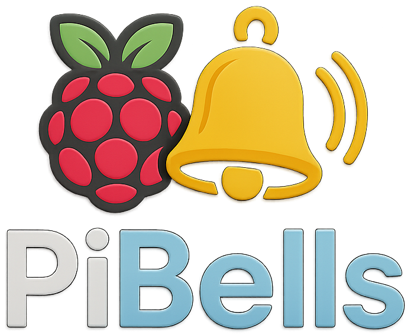

<p align="center">
  
</p>

<h1 align="center">PiBells</h1>

<p align="center">
  <b>Network bell scheduling for Raspberry Pi</b><br>
  <a href="LICENSE"></a>
  <a href="https://pixelpacific.com"></a>
</p>

PiBells is a lightweight bell scheduler built with FastAPI. Use the web interface to create schedules, upload sounds and manage your Barix devices. Perfect for schools or facilities needing a simple network bell system.

## Features
- 📅 Create multiple schedules from your browser
- 🔊 Trigger Barix devices or play audio locally
- 🌐 Scan your network to discover devices automatically
- 🎵 Upload MP3, WAV, OGG or M4A files as bell sounds
- 🔘 Create custom quick-play buttons
- 🔄 Update the software from the admin page

## Hardware
 - Raspberry Pi 4 Model B (4 GB+ recommended)
- microSD card (8 GB or larger) with Raspberry Pi OS
- Network connection (Ethernet or Wi-Fi)

## Installation
Run the install script on your Pi with `sudo`:

```bash
curl -L https://raw.githubusercontent.com/alinaric/PiBells/main/install.sh | sudo bash
```

The script installs dependencies, sets up a virtual environment, clones the repo and creates a `systemd` service so PiBells starts on boot. You can run the same command again at any time to update.

Once the service is running, open `http://<raspberrypi-ip>/` in your browser to log in and configure your bells.

### Manual steps
If you prefer to do things yourself, see [`install.sh`](install.sh) for the commands.

## Preparing the Raspberry Pi
1. Use **Raspberry Pi Imager** and select the **Raspberry Pi OS (64-bit)** "Recommended" image.
2. In the Imager's advanced options, configure your username, password, network and enable SSH if desired.
3. Insert the card into the Pi, power it on and wait for it to connect to your network.
4. Log in as the user you configured and run the install script above. It will update the system and install all dependencies.

## Versioning
The current version is defined in [`app/__init__.py`](app/__init__.py). The admin page checks GitHub for updates and lets you upgrade with a single click.

---

Distributed under the [PixelPacific Public License (PPPL 1.0)](LICENSE).  
Learn more about PixelPacific at [pixelpacific.com](https://pixelpacific.com).
